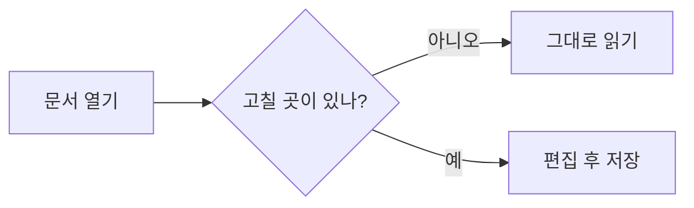

# Markdown 사용설명서

이 문서는 MDnote에 처음 들어오면 열리는 **연습용 문서**입니다. 왼쪽이 원본(입력한 글), 오른쪽이 결과(보이는 모습)입니다. 왼쪽 글을 직접 고쳐 보면서 규칙을 익혀 보세요. 언제든 오른쪽 위 **⚙ 설정 → 도움말 → Markdown 사용설명서**로 다시 열 수 있습니다.

> Markdown은 글 앞뒤에 간단한 기호를 붙여 서식을 정하는 방식입니다. 기호는 몇 개 되지 않고, 아래 순서대로 익히면 충분합니다.

## 1. 제목

`#` 기호 뒤에 한 칸 띄고 제목을 씁니다. `#` 개수가 많을수록 작은 제목이 됩니다. 제목은 왼쪽 **목차** 패널에 자동으로 모입니다.

# 대제목 (# 1개)
## 중제목 (## 2개)
### 소제목 (### 3개)
#### 더 작은 제목 (#### 4개)

## 2. 문단과 줄바꿈

문단은 **빈 줄**로 나눕니다. 그냥 줄만 바꾸면 같은 문단으로 이어집니다.

이 줄은 위 문장과
같은 문단입니다. (줄만 바꿈)

이 줄은 빈 줄을 하나 두었으므로 새 문단입니다.

## 3. 강조

| 원하는 모습 | 이렇게 씁니다 | 결과 |
| --- | --- | --- |
| 굵게 | `**중요**` | **중요** |
| 기울임 | `*강조*` | *강조* |
| 취소선 | `~~삭제~~` | ~~삭제~~ |
| 코드 | `` `이름` `` | `이름` |

툴바의 **B**, *I*, ~~S~~ 버튼이나 `Ctrl+B`, `Ctrl+I`를 눌러도 됩니다. 글을 먼저 드래그해서 고른 뒤 누르세요.

## 4. 목록

줄 앞에 `-` 를 붙이면 글머리 목록, `1.` 을 붙이면 번호 목록입니다. 앞에 공백 두 칸을 넣으면 한 단계 들어갑니다.

- 사과
- 배
  - 신고배 (공백 두 칸으로 들여쓰기)
  - 원황배
- 포도

1. 재료를 준비한다
2. 물을 끓인다
3. 면을 넣는다

## 5. 체크리스트

`- [ ]` 는 빈 칸, `- [x]` 는 완료입니다. 읽기 모드에서 상자를 클릭하면 원본이 함께 바뀝니다.

- [x] MDnote 설치
- [x] 사용설명서 읽기
- [ ] 내 문서 열어 보기
- [ ] 편집해서 저장하기

## 6. 링크와 이미지

링크는 `[보이는 글](주소)`, 이미지는 앞에 `!` 를 붙여 `` 로 씁니다.

- [Markdown 소개 (위키백과)](https://ko.wikipedia.org/wiki/마크다운)
- 주소를 그대로 적어도 링크가 됩니다: https://example.com


## 7. 인용

줄 앞에 `>` 를 붙입니다. 다른 사람의 말이나 참고 문구에 씁니다.

> 좋은 문서는 읽는 사람의 시간을 아껴 준다.
> 두 줄 이상도 됩니다.

## 8. 코드

짧은 코드는 글 안에서 `` ` `` 로 감쌉니다: `npm run dev`

여러 줄 코드는 ` ``` ` 세 개로 감싸고, 여는 줄에 언어 이름을 적으면 색이 입혀집니다.

```python
def greet(name):
    return f"안녕하세요, {name}님"
```

```bash
npm install
npm run dev
```

## 9. 표

`|` 로 칸을 나누고, 둘째 줄에 `---` 를 넣으면 표가 됩니다. `:---:` 는 가운데 정렬, `---:` 는 오른쪽 정렬입니다.

| 항목 | 수량 | 가격 |
| --- | :---: | ---: |
| 연필 | 3 | 1,500원 |
| 공책 | 2 | 4,000원 |

툴바의 **표** 버튼을 누르면 뼈대가 들어옵니다.

## 10. 구분선

`---` 만 있는 줄은 가로 구분선이 됩니다.

---

## 11. 다이어그램 (Mermaid)

` ```mermaid ` 블록 안에 흐름을 글로 적으면 그림이 됩니다. 툴바의 **다이어그램** 버튼으로 뼈대를 넣을 수 있습니다.



## 12. 자주 쓰는 단축키

| 동작 | 키 |
| --- | --- |
| 파일 열기 / 저장 / 다른 이름으로 저장 | `Ctrl+O` / `Ctrl+S` / `Ctrl+Shift+S` |
| 찾기 (편집 모드에서는 바꾸기 포함) | `Ctrl+F` |
| 읽기 / 편집 / 나란히 | `Ctrl+1` / `Ctrl+2` / `Ctrl+3` |
| 굵게 / 기울임 / 링크 | `Ctrl+B` / `Ctrl+I` / `Ctrl+K` |
| 실행 취소 / 다시 실행 | `Ctrl+Z` / `Ctrl+Y` |
| PDF로 내보내기 (인쇄) | `Ctrl+P` |

## 13. 연습해 보기

아래 빈 칸을 왼쪽 창에서 직접 채워 보세요.

### 내 소개

- 이름:
- 하는 일:
- 좋아하는 것: **(굵게 써 보세요)**

### 오늘 할 일

- [ ]
- [ ]

---

작성 중인 내용은 자동으로 임시 저장되며, 창을 닫았다 다시 열어도 복원할 수 있습니다. 내 문서를 열려면 `Ctrl+O`, 폴더째 열려면 왼쪽 **폴더 열기**를 누르세요.
